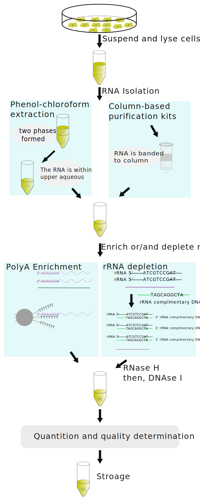

.. .. contents:: Content
   :depth: 1
   

==========================
RNA Sequencing
==========================

Bulk RNA Sequencing
==========================

RNA Isolation
---------------------

Figure 1. RNA Isolation process

Extract Total RNA
+++++++++++++++++++++

Because RNA within cells is dynamic and fragile, so the cells
that parpared for RNA extraction should stored properlly. The sample,
which is cells, tissue or other material, should be
lysed in a buffer that disrupts cell membranes and releases the RNA.
To remove proteins and protect RNA from degradation,
a denaturing agent such as guanidine thiocyanate or guanidine hydrochloride
is added to the lysed sample.

There are many RNA-seq tikits in the market, the tikits many use differenct
method to extract RNA. For example,

* Phenol-chloroform extraction

    Phenol-chloroform extraction is a classic method widely used for RNA extraction from various biological samples. It relies on the differential solubility of RNA in phenol and chloroform to separate RNA from other cellular components. Here's an overview of the phenol-chloroform extraction method:

    1. Sample preparation:
        
        The method begins with the preparation of the sample. The sample can be cells, tissues, or other biological material containing RNA. The sample is typically lysed in a buffer that disrupts cell membranes and releases the RNA.

    2. Protein denaturation: 

        To remove proteins and protect RNA from degradation, a denaturing agent such as guanidine thiocyanate or guanidine hydrochloride is added to the lysed sample. The denaturants disrupt protein structures, facilitating subsequent separation steps.

    3. Organic extraction:
        
        Phenol, a water-immiscible organic solvent, is added to the sample. Phenol denatures proteins and disrupts protein-RNA interactions, allowing the separation of RNA from proteins. The mixture is thoroughly mixed or vortexed to ensure proper extraction.

    4. Phase separation: 
        
        The addition of chloroform (or a chloroform-isoamyl alcohol mixture) to the sample results in the formation of a biphasic system. The mixture is centrifuged, causing the separation of the sample into distinct phases: an upper aqueous phase containing RNA, a lower organic phase containing proteins and lipids, and an interphase containing DNA and other cellular debris.

    5. RNA recovery:

        The upper aqueous phase, which contains RNA, is carefully transferred to a new tube while avoiding the interphase and the organic phase. This step ensures the separation of RNA from contaminants.

    6. RNA precipitation:
        
        Isopropanol or ethanol is added to the aqueous phase to precipitate the RNA. The addition of these alcohol solutions causes the RNA to become insoluble and form a visible pellet. The mixture is incubated at low temperatures or centrifuged to enhance precipitation.

    7. Wash and purification:

        The RNA pellet is washed with ethanol to remove residual salts, phenol, and other impurities. The RNA is then air-dried or dissolved in an appropriate buffer, such as RNase-free water, for downstream applications.

    Phenol-chloroform extraction is a labor-intensive method and requires careful handling of organic solvents, as they can be hazardous. It is important to work in a well-ventilated area, wear appropriate safety equipment, and follow proper disposal protocols.

    While phenol-chloroform extraction is a robust method for RNA extraction, it has some limitations. It is time-consuming, requires skilled laboratory techniques, and may result in RNA degradation if not performed carefully. Therefore, many researchers have shifted to using commercial RNA extraction kits based on column-based or magnetic bead-based purification methods, which offer convenience, reproducibility, and higher throughput.   

* Column-based purification kits

    Commercial kits based on spin columns are widely used for RNA extraction. These kits typically use silica-based membranes that specifically bind RNA, while contaminants are removed through washing steps. Column-based methods offer convenience, reproducibility, and high-quality RNA isolation. Examples include the RNeasy Mini Kit from Qiagen and the PureLink RNA Mini Kit from Thermo Fisher Scientific.

* Magnetic bead-based methods

    These methods use magnetic beads coated with specific molecules that selectively bind RNA. The beads are mixed with the sample, and the RNA-bound beads are separated using a magnetic field. Magnetic bead-based methods are popular due to their ease of use, scalability, and compatibility with automation. The MagMAX RNA Isolation Kit from Thermo Fisher Scientific and the Ambion MagMAX RNA Isolation Kit from Invitrogen are examples of magnetic bead-based RNA extraction kits.

rRNA depletion or enrichment of interested RNA
++++++++++++++++++++++++++++++++++++++++++++++++++++

Above method would isolate all RNA from sample. Different RNA types have differenct abandence, for example, rRNA account for about 80% of all RNA in mammal cells. A process which erich or deleption specific RNA type maybe need to remove not needed RNA types and achieve specific experimental purpose [1]_.

* rRNA depletion
    
    - RNase H method

        A DNA probe which complement to rRNA is added into sample, and then, RNase H was added, which degrade RNA. And lately, DNAse I was
        introduced into solution, which degrade DNA.

    - Biotin label method

        Biotinlated rRNA complementative DNA probes is intruduced, and megnetic streptavidin beads would selectively pull
        down the rRNA which hybrided with DNA probes.

* polyA enrichment
    
    The mRNA can be enriched by oligo(dT) beads.

Quantitation and Quality
+++++++++++++++++++++++++++++++++++

- quantitation
    
    Absorbance or dye methods can be used to test the concentration of RNA.

- quality

    Spectrophotometric Analysis: Measure the concentration and assess the purity of the RNA sample using a spectrophotometer. The absorbance ratios at specific wavelengths (e.g., A260/A280 and A260/A230) can provide insights into the purity of the RNA, indicating the presence of contaminants like proteins or chemicals. A high A260/A280 ratio (around 2.0) indicates pure RNA.

    Electrophoresis: Perform gel electrophoresis to visualize the integrity and size distribution of the RNA molecules. Run the extracted RNA on an agarose gel, and observe distinct bands representing intact RNA species. The presence of discrete bands without smearing or degradation indicates good RNA quality.

    RNA Integrity Number (RIN): Use a specialized instrument, such as a Bioanalyzer or TapeStation, to obtain an RNA Integrity Number (RIN). These systems analyze the electrophoretic mobility of RNA and generate a RIN score, ranging from 1 to 10, where higher scores indicate better RNA quality. RIN scores above 7 are generally considered as good quality.

Store RNA
++++++++++++++++++++

The isolated RNA sample should stored in cold and RNAase free solution.

Library Preparation
------------------------

Fregmente RNA
+++++++++++++++++++

Random Primer RT for the first strand
++++++++++++++++++++++++++++++++++++++

Sythethese second strand dUTP added
++++++++++++++++++++++++++++++++++++++

ligate adapter
+++++++++++++++++++++++++++++++++++++

dUTP strand degradation or specific amplification
+++++++++++++++++++++++++++++++++++++++++++++++++++++++

Library Amplification
++++++++++++++++++++++++++

Sequencing
-----------------

Quality Control of Data
--------------------------------

Reads Mapping and Counting
--------------------------------

Data Normalization
----------------------

Comparison between Samples
----------------------------

Single Cell RNA Sequencing
===========================

Spatial RNA Sequencing
===========================

Reference
===========================

.. [1] Non-coding RNA: what is functional and what is junk? 
.. [2] https://hbctraining.github.io/rnaseq-cb321/lectures/Lib_prep.pdf
.. [3] RNA-Seq methods for transcriptome analysis
