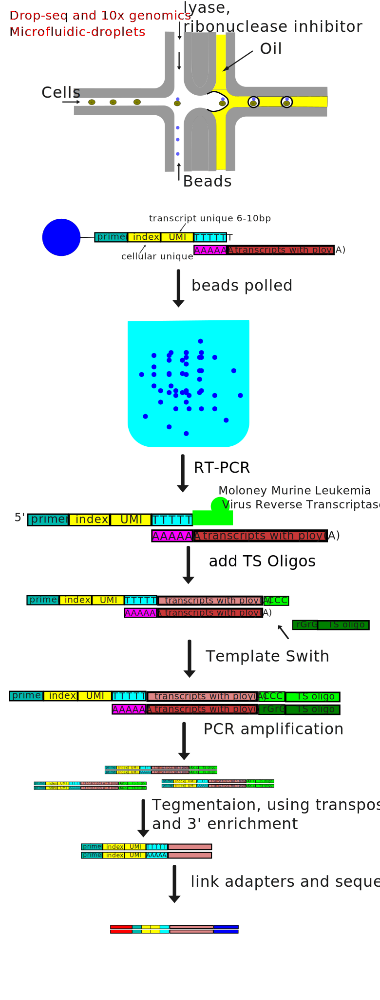

==========================
RNA Sequencing
==========================

.. contents:: Contents
   :depth: 1

Bulk RNA Sequencing
==========================

RNA Isolation
---------------------

Figure 1. RNA Isolation process

.. note::

   The method intruduced here is only a some portion of all.

Extract Total RNA
+++++++++++++++++++++

Because RNA within cells is dynamic and fragile, so the cells
that parpared for RNA extraction should stored properlly. The sample,
which is cells, tissue or other material, should be
lysed in a buffer that disrupts cell membranes and releases the RNA.
To remove proteins and protect RNA from degradation,
a denaturing agent such as guanidine thiocyanate or guanidine hydrochloride
is added to the lysed sample.

There are many RNA-seq tikits in the market, the tikits many use differenct
method to extract RNA. For example,

* Phenol-chloroform extraction

    Phenol-chloroform extraction is a classic method widely used for RNA extraction from various biological samples. It relies on the differential solubility of RNA in phenol and chloroform to separate RNA from other cellular components. Here's an overview of the phenol-chloroform extraction method:

    1. Sample preparation:
        
        The method begins with the preparation of the sample. The sample can be cells, tissues, or other biological material containing RNA. The sample is typically lysed in a buffer that disrupts cell membranes and releases the RNA.

    2. Protein denaturation: 

        To remove proteins and protect RNA from degradation, a denaturing agent such as guanidine thiocyanate or guanidine hydrochloride is added to the lysed sample. The denaturants disrupt protein structures, facilitating subsequent separation steps.

    3. Organic extraction:
        
        Phenol, a water-immiscible organic solvent, is added to the sample. Phenol denatures proteins and disrupts protein-RNA interactions, allowing the separation of RNA from proteins. The mixture is thoroughly mixed or vortexed to ensure proper extraction.

    4. Phase separation: 
        
        The addition of chloroform (or a chloroform-isoamyl alcohol mixture) to the sample results in the formation of a biphasic system. The mixture is centrifuged, causing the separation of the sample into distinct phases: an upper aqueous phase containing RNA, a lower organic phase containing proteins and lipids, and an interphase containing DNA and other cellular debris.

    5. RNA recovery:

        The upper aqueous phase, which contains RNA, is carefully transferred to a new tube while avoiding the interphase and the organic phase. This step ensures the separation of RNA from contaminants.

    6. RNA precipitation:
        
        Isopropanol or ethanol is added to the aqueous phase to precipitate the RNA. The addition of these alcohol solutions causes the RNA to become insoluble and form a visible pellet. The mixture is incubated at low temperatures or centrifuged to enhance precipitation.

    7. Wash and purification:

        The RNA pellet is washed with ethanol to remove residual salts, phenol, and other impurities. The RNA is then air-dried or dissolved in an appropriate buffer, such as RNase-free water, for downstream applications.

    Phenol-chloroform extraction is a labor-intensive method and requires careful handling of organic solvents, as they can be hazardous. It is important to work in a well-ventilated area, wear appropriate safety equipment, and follow proper disposal protocols.

    While phenol-chloroform extraction is a robust method for RNA extraction, it has some limitations. It is time-consuming, requires skilled laboratory techniques, and may result in RNA degradation if not performed carefully. Therefore, many researchers have shifted to using commercial RNA extraction kits based on column-based or magnetic bead-based purification methods, which offer convenience, reproducibility, and higher throughput.   

* Column-based purification kits

    Commercial kits based on spin columns are widely used for RNA extraction. These kits typically use silica-based membranes that specifically bind RNA, while contaminants are removed through washing steps. Column-based methods offer convenience, reproducibility, and high-quality RNA isolation. Examples include the RNeasy Mini Kit from Qiagen and the PureLink RNA Mini Kit from Thermo Fisher Scientific.

* Magnetic bead-based methods

    These methods use magnetic beads coated with specific molecules that selectively bind RNA. The beads are mixed with the sample, and the RNA-bound beads are separated using a magnetic field. Magnetic bead-based methods are popular due to their ease of use, scalability, and compatibility with automation. The MagMAX RNA Isolation Kit from Thermo Fisher Scientific and the Ambion MagMAX RNA Isolation Kit from Invitrogen are examples of magnetic bead-based RNA extraction kits.

rRNA depletion or enrichment of interested RNA
++++++++++++++++++++++++++++++++++++++++++++++++++++

Above method would isolate all RNA from sample. Different RNA types have differenct abandence, for example, rRNA account for about 80% of all RNA in mammal cells. A process which erich or deleption specific RNA type maybe need to remove not needed RNA types and achieve specific experimental purpose [#]_.

* rRNA depletion
    
    - RNase H method

        A DNA probe which complement to rRNA is added into sample, and then, RNase H was added, which degrade RNA. And lately, DNAse I was
        introduced into solution, which degrade DNA.

    - Biotin label method

        Biotinlated rRNA complementative DNA probes is intruduced, and megnetic streptavidin beads would selectively pull
        down the rRNA which hybrided with DNA probes.

* polyA enrichment
    
    The mRNA can be enriched by oligo(dT) beads.

Quantitation and Quality
+++++++++++++++++++++++++++++++++++

- quantitation
    
    Absorbance or dye methods can be used to test the concentration of RNA.

- quality

    Spectrophotometric Analysis: Measure the concentration and assess the purity of the RNA sample using a spectrophotometer. The absorbance ratios at specific wavelengths (e.g., A260/A280 and A260/A230) can provide insights into the purity of the RNA, indicating the presence of contaminants like proteins or chemicals. A high A260/A280 ratio (around 2.0) indicates pure RNA.

    Electrophoresis: Perform gel electrophoresis to visualize the integrity and size distribution of the RNA molecules. Run the extracted RNA on an agarose gel, and observe distinct bands representing intact RNA species. The presence of discrete bands without smearing or degradation indicates good RNA quality.

    RNA Integrity Number (RIN): Use a specialized instrument, such as a Bioanalyzer or TapeStation, to obtain an RNA Integrity Number (RIN). These systems analyze the electrophoretic mobility of RNA and generate a RIN score, ranging from 1 to 10, where higher scores indicate better RNA quality. RIN scores above 7 are generally considered as good quality.

Store RNA
++++++++++++++++++++

The isolated RNA sample should stored in cold and RNAase free solution.

Library Preparation
------------------------

The RNA is uausally fragmented before reverse transcription, that is because reverse transcription may cause 3' bias and make read more enriched at 3'. The fragmented RNA is primed by randem primer(6 oligo DNA) and the first strand is sythesised. In order to keep the strand information which strand is RNA and ligend adeptor, when synthesising seconde strand, instead using dTTP, the dUTP is added. This cuase the second strand reprent U where is T originally. The stand contain U can be degraded, and even more, the DNA polymerase would blocked when meet U [#]_.

.. note::

   The method intruduced here is only a some portion of all.

Fragmente RNA
+++++++++++++++++++

RNAs can be fragmented with alkaline solutions, solutions with divalent cations, such Mg+ +, Zn++, or enzymes, such RNase III. Fragmentation with alkaline solutions or divalent cations is typically carried out at an elevated temperature, such as 70°C, to mitigate the effect of RNA structure on fragmentation [#]_.

Random Primer RT for the first strand
++++++++++++++++++++++++++++++++++++++

A randem primer of 6 nt length would be used to transcirpt RNA reverselly. The the RNA be degraded.

Sythethese second strand dUTP added
++++++++++++++++++++++++++++++++++++++

When syntheseing second strand, instead using dTTP, dUTP was used, this will label the second strand.

ligate adapter
+++++++++++++++++++++++++++++++++++++

Here is some examples of adapters [#]_.

dUTP strand degradation or specific amplification
+++++++++++++++++++++++++++++++++++++++++++++++++++++++

Library Amplification
++++++++++++++++++++++++++

Sequencing
-----------------

Quality Control of Data
--------------------------------

After getting sequencing data, the adapter sequece need be removed if
it is sequenced when sequencing inserting. The PCR introduced duplications
need be removed too. And if reads have low qulity base, those base need be
trimed.

Test quality of sequencing results
++++++++++++++++++++++++++++++++++++++

The software FastQC is a commonly used tool to test the
sequencing quality and disclose the petential problems of
sequencing system.

File format of data
++++++++++++++++++++++++++++++

Fastq file format is commonly used format for sequencing data [#]_ ::

    A FASTQ file has four line-separated fields per sequence:

    Field 1 begins with a '@' character and is followed by a sequence identifier and an optional description (like a FASTA title line).
    Field 2 is the raw sequence letters.
    Field 3 begins with a '+' character and is optionally followed by the same sequence identifier (and any description) again.
    Field 4 encodes the quality values for the sequence in Field 2, and must contain the same number of symbols as letters in the sequence.

Test adapter and index sequence and remove it if exist
++++++++++++++++++++++++++++++++++++++++++++++++++++++++++

If there are residual adapter sequence in the reads, then those
adapter sequence need be removed. The softwase cutadapter can be
used for this task.

Remove PCR introduce duplications
++++++++++++++++++++++++++++++++++++++

The PCR amplification would intruduce complete same reads in the results. those
reads need be removed. As for the sofrware for this task, iSAMtools rmdup and FastUniq are an tools for
this.

Trim low quality bases
+++++++++++++++++++++++++++

The quality is caululated by following formula:

**The quality of base is denoted by Q.
The posibility that the base is incorrect is donoted by P.**

.. math::

    Q & = -10 * \log_{10}(P)

    quality\_char & = chr(Q + 33)

For example::
    
    The error probility is 0.01, the Q is 20.
    So, the value add to 33 is 53, the ascii is
    '7'.

If low quality bases presented, those bases need be removed. Trimmomatic can do this job.

Reads Mapping and Counting
-----------------------------------

The data after QC is ready for reads mapping.
There are several software existed to do reads mapping.
They are include *Bwa*, *Bowtie2*, *Star*, *Hisat2*, *Tophat2* and so on.

After reads mapping, software *HTSeq* can be used to count read to each
transcript or segment of genome.

Map reads to reference sequence
+++++++++++++++++++++++++++++++++++

Here are some example to map the reads data.

.. code:: sh

    # data: sigle seq data: SRR6890845.fastq, genome: GCF_000002035.6_GRCz11_genomic.fna,
    # transcripts: GCF_000002035.6_GRCz11_rna.fna, annotation data: GCF_000002035.6_GRCz11_genomic.gff.gz.

    #bwa
    bwa index GCF_000002035.6_GRCz11_genomic.fna
    bwa mem GCF_000002035.6_GRCz11_genomic.fna SRR6890845.fastq -o SRR6890845-map.sam
    

Count Reads
++++++++++++++++++++++++++++++++++

.. code::

    htseq-count SRR6890845-map.sam GCF_000002035.6_GRCz11_genomic.gtf -c read_count.csv

**The Reads Countting Matrix:** :math:`M_{ori}`

.. math::

    M_{ori} = \begin{bmatrix}
        d_{1,1} & d_{1,2} & \cdots & d_{1,m} \\
        d_{2,1} & d_{2,2} & \cdots & d_{2,m} \\
        \vdots  & \vdots  & \ddots & \vdots  \\
        d_{n,1} & d_{n,2} & \cdots & d_{n,m}
        \end{bmatrix}

**The read countting of one sameple** :math:`V_i`

.. math::

    V_i = \begin{bmatrix}d_{1,i}\\
           d_{2,i}\\
           \vdots\\
           d_{n,i}\end{bmatrix}
    
    i \in \{1, 2, \cdots, m\}

expressing matrix and its normalization
-------------------------------------------

Reads Per Kilobase of transcript per Million reads mapped (RPKM)
+++++++++++++++++++++++++++++++++++++++++++++++++++++++++++++++++++

within sample comparison.

For sample i:

.. math::
   

    d\_rpkm_{j,i} = \frac{d_{j, i}}{S * l_j} * 10^9

.. math::
   
    S = \sum_{j=1}^{n}d_{j,i}

.. math::

    10^9 \neq 10^9 * \sum_{j=1}^{n} \frac{d_{j,i}}{l_j*S} = \frac{10^9}{S} \sum_{j=1}^{n} \frac{d_{j,i}}{l_j}

fragments per kilobase of transcript per million fragments mapped (FPKM)
++++++++++++++++++++++++++++++++++++++++++++++++++++++++++++++++++++++++++++

FPKM is closely related to RPKM except with fragment (a pair of reads) replacing
read (the reason for this nomenclature is historical, since initially reads were 
single-end, but with the advent of paired-end sequencing it now makes more 
sense to speak of fragments, and hence FPKM) [#]_.

Transcripts Per Million (TPM)
++++++++++++++++++++++++++++++++

Within sample.

.. math::

    V\_tpm_{j, i} = 10^6 * \frac{d_{j,i}/l_j}{\sum_{j=1}^{n}(d_{j,i}/l_j)}

trimmed mean of M values (TMM) adopted by edgeR 
++++++++++++++++++++++++++++++++++++++++++++++++++++

normalized for comparison across samples [#]_.

Define Y gk as the observed count for gene g in library k summarized from the raw reads, μ gk as the true and unknown expression level (number of transcripts), L g as the length of gene g and N k as total number of reads for library k. 

.. math::

    E[Y_{gk}] = \frac{\mu_{gk}L_g}{S_k} * N_k

    where S_k = \sum_{g=1}^{G}\mu_{gk}L_g

    M_g = \log_2 \frac{Y_{gk}/N_k}{Y_{gk'}/N_{k'}}

    A_g = \frac{1}{2} \log_2 (Y_{gk} / Nk * Y_{gk'}/N_{k'}) for Y_g \neq 0

RLE used by DESeq2
+++++++++++++++++++++++++++++++++++++

Here is code from DESeq2 manual.

.. code::

    # see vignette for suggestions on generating
    # count tables from RNA-Seq data
    cnts <- matrix(rnbinom(n=1000, mu=100, size=1/0.5), ncol=10)
    cond <- factor(rep(1:2, each=5))
    # object construction
    dds <- DESeqDataSetFromMatrix(cnts, DataFrame(cond), ~ cond)
    # standard analysis
    dds <- DESeq(dds)
    res <- results(dds)
    # moderated log2 fold changes
    resultsNames(dds)
    resLFC <- lfcShrink(dds, coef=2, type="apeglm")
    # an alternate analysis: likelihood ratio test
    ddsLRT <- DESeq(dds, test="LRT", reduced= ~ 1)
    resLRT <- results(ddsLRT)

Comparison between Samples
----------------------------

de nove assembly for RNA
------------------------------

alternative splicing
----------------------

new gene discovery
---------------------------

Single Cell RNA Sequencing
===========================

Single cell isolation
--------------------------

Microfluidics method
++++++++++++++++++++++++++++++++++++++++

Emploied by:

droplet-based
+++++++++++++++++++++

Plate based
+++++++++++++++++++

Microwell
++++++++++++++++

Library Making
----------------

Sequencing
------------------

Data analysis 
-------------------------
empty droplet deletion, dimensional reduction, prediction of cellular type, analysis of trajectories/pseudotime and unsupervised clustering

Spatial RNA Sequencing
===========================

Sequencing machines
========================

A machine Used to sequencing.

Illumina
---------------------

* NextSeq® 550

* HiSeq 4000(discontinued)

Library preparation kits
==============================

Used to perpare sequencing library.

Illumina
--------------

* TruSeq® library preparation kit

Sequencing kits
========================

Used when squencing, including reagent, flow cell, and buffer.

Illumina
----------------

Reference
===========================

.. [#] Non-coding RNA: what is functional and what is junk? 
.. [#] https://hbctraining.github.io/rnaseq-cb321/lectures/Lib_prep.pdf
.. [#] RNA-Seq methods for transcriptome analysis
.. [#] https://bioinformatics.cvr.ac.uk/illumina-adapter-and-primer-sequences/
.. [#] https://en.wikipedia.org/wiki/FASTQ_format
.. [#] Misuse of RPKM or TPM normalization when comparing across samples and sequencing protocols
.. [#] A scaling normalization method for differential expression analysis of RNA-seq data

http://nextgen.mgh.harvard.edu/IlluminaChemistry.html

https://teichlab.github.io/scg_lib_structs/methods_html/Illumina.html

https://support.illumina.com/help/BaseSpace_OLH_009008/Content/Source/Informatics/BS/QualityScoreEncoding_swBS.htm
