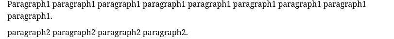
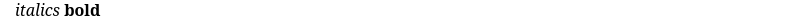
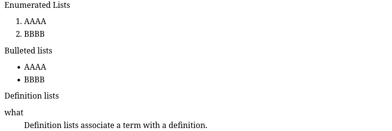
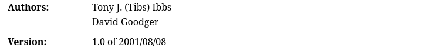
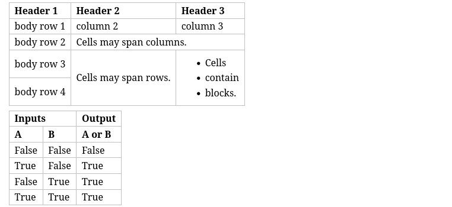
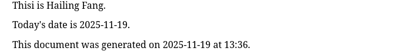

reStructruedText
=========================

:Created: 20251118

:Updated: 20251118

Syntax
----------------

Titles
~~~~~~~~~~~~~~~~

.. code::

    Tilte h1
    =============

    Subtitle h2
    -----------------

**Rendered Results**:

.. image:: ./restructuredtext/p1-title.png

Paragraph
~~~~~~~~~~~~~~~~~~~~~

.. code::

    Paragraph1 paragraph1 paragraph1
    paragraph1 paragraph1 paragraph1 paragraph1 paragraph1
    paragraph1.

    paragraph2 paragraph2 paragraph2
    paragraph2.

**Rendered Results**:

Text styles
~~~~~~~~~~~~~~~~~~~~~

.. code::

    *italics* **bold**

**Rendered Results**:

Lists
~~~~~~~~~~~~~~~

.. code::

    Enumerated Lists
    
    1. AAAA
    2. BBBB
   
    Bulleted lists
    
    - AAAA
    - BBBB

    Definition lists

    what
      Definition lists associate a term with a definition.

**Rendered Results**:

Preformatting
~~~~~~~~~~~~~~~~~~~~~

.. code::

    ::
        
        - Do not render
        - Do not render

**Rendered Results**:

.. image:: restructuredtext/p5-preformatted.png

    
Field Lists
~~~~~~~~~~~~~~~~~~~~~~

.. code::

    :Authors:
        Tony J. (Tibs) Ibbs,
        David Goodger

    :Version: 1.0 of 2001/08/08

**Rendered Results**:

Tables
~~~~~~~~~~~~~~~~~~~

.. code::

    +------------+------------+-----------+
    | Header 1   | Header 2   | Header 3  |
    +============+============+===========+
    | body row 1 | column 2   | column 3  |
    +------------+------------+-----------+
    | body row 2 | Cells may span columns.|
    +------------+------------+-----------+
    | body row 3 | Cells may  | - Cells   |
    +------------+ span rows. | - contain |
    | body row 4 |            | - blocks. |
    +------------+------------+-----------+

    =====  =====  ======
       Inputs     Output
    ------------  ------
      A      B    A or B
    =====  =====  ======
    False  False  False
    True   False  True
    False  True   True
    True   True   True
    =====  =====  ======

**Rendered Results**:

Links
--------------

.. code::

    #Inline links

    This is `My Website <https://hailingfang.github.io/index.html>`_.

    #Outline links
    
    This is `My Website`_.

    .. _My Website: https://hailingfang.github.io/index.html

Footnotes and Citations
---------------------------------

.. code::

   # Footnotes

   Hi, This is a footnote [5]_.

   .. [5] The footnote contents.

   # Citations

   This a a citation [Cite]_.

   .. [Cite] Cite contents.

Replacement
------------------------

.. code::

   Thisi is |My Name|.

   .. |My Name| replace:: Hailing Fang

    Today's date is |date|.

    This document was generated on |date| at |time|.

    .. |date| date::
    .. |time| date:: %H:%M

**Rendered Results**

Directives
--------------------------------

::

    .. image:: 
    .. figure::
    .. code::
    .. math::
    .. table::
    .. csv-table::
    .. list-table::
    .. contents::
    .. target-note::
    .. ootnotes::
    .. citations::
    .. raw::
    .. include::
    .. note::
    .. warning::

Roles
-------------------------

::

    :code:
    :math:
    :raw:
    :subscript:
    :superscript:

References
----------------

https://docutils.sourceforge.io/docs/user/rst/quickstart.html

https://docutils.sourceforge.io/docs/user/rst/quickref.html

https://docutils.sourceforge.io/docs/ref/rst/restructuredtext.html

