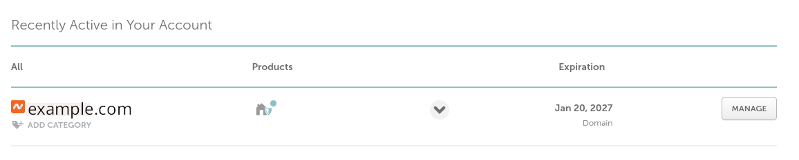
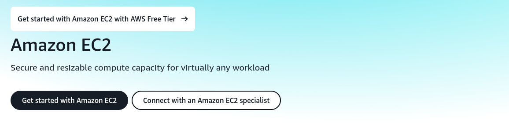
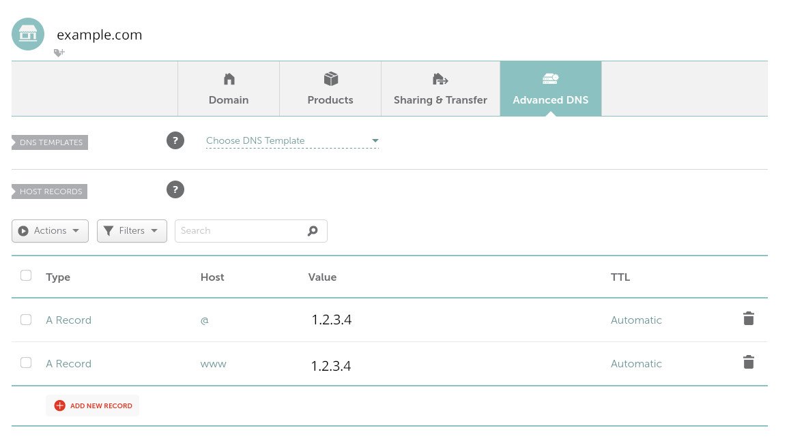

Start A Website
==================

1. Have a plan on the website
--------------------------------------------------

Have a plan on the website. Here I just need a practice for
website deplyment, some the resources required is small. Following
is what I have done.

- Bought a domain name on namecheap.com.

- Apply a free tier on amazon and got a EC2 computing resource, got a server and a public IP.

- Configured namecheap.com, let the domain name point to the IP of the serser.

- Employ Nginx as http server utility.

- Using Certbot to certificate my domain, started https schame.

- Configure Nginx.

2. Register a domaini name
-------------------------------

- Visit https://www.namecheap.com, and sign up.

- Click the **Domain** tab, search the domain name that I want to register.

- I search a domain name, let say "example.com", the serach result shown that the domain name is not register.
    So, I bought it. The cost is about $12 per year.

- Got to the Doshboard of my account (https://ap.www.namecheap.com), I can saw that I have acquired the domain name successfully.

3. Apply EC2 free Tier
-----------------------------

- Visit https://aws.amazon.com/ec2/, and apply EC2 free tier. You may need a credit card here.

- Follwing the directions of the website, to apply EC2 free tier.

- Start a EC2 instance, and got a IP. Let say the IP address is 1.2.3.4

.. note::

   When start the EC2 instance, I choose Fedora as my OS image.

.. note::

   When start EC2 the instance, I generate I key for login. The name of private key file is "amazon-ec2-key.pem"
   I well login to the EC2 instance by bash command: ssh -i "amazon-ec2-key.pem" fedora@1.2.3.4

4. Make domain name point to IP on namecheap.com
-----------------------------------------------------------

- Go to https://ap.www.namecheap.com/, click "MANGE" along the domain name that I want to configure.

- I added two record, please see the image.

5. Install Nginx and configure the server
-----------------------------------------------

- Log in the EC2 server using ssh remotely.

.. code:: bash

   ssh -i "amazon-ec2-key.pem" fedora@1.2.3.4

- Create root password

.. code::

   sudo passwd root 

- Install Nginx

.. code::

   dnf install nginx.x86_64

- Add http and https services

.. code::

   firewall-cmd --add-service=https --permanent
   firewall-cmd --add-service=http --permanent
   systemctl reload firewalld.service

- Enable and start Nginx

.. code::

   systemctl enable nginx
   systemctl start nginx

6. Using certbot to certificate the domain
-----------------------------------------------------

- Install certbot and its Nginx plugin

.. code::

   dnf install certbot python3-certbot-nginx

- Cerficate

.. code::

   certbot --nginx

.. raw:: html

    

Now Every should works.
