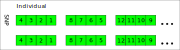

# BED file

## .fam file
A text file without header line. and one line per sample with six fields.
1. Family ID
2. Within-family ID(cannot be '0')
3. Within-family ID of father('0' if father isn't in dataset)
4. Within-family ID of mother('0' if mother isn't in dataset)
5. sex code('1' for male, '2' for female, '0' for unknown)
6. Phenotype value('1' for control, '2' for case, '-9'/'0' for missing data)


## .bim file  
extended variant information file accompanying a .bed binary genotype table. have no
header line, and each line contain six fields.
1. chromosome code(and integer or X, Y, XY, MT, 0 indicate unknown)
2. variant identifier
3. position in morgans or centimorgans
4. base pair coordinate
5. allele 1
6. allele 2

## .bed file

```
[]<>(info="plink bed file")
[%file $famfile]<>(file="fam file")
[%file $bimfile]<>(file="bim file")
[%let $famfile_len = $filelen($famfile)]
[%let $bimfile_len = $filelen($bimfile)]
[%let $data_len_per_vari = $ceil(famfile_len / 4)]
[3]<char; =[0x6c, 0x1b, 0x01]>(dsp="magic number, in lasted plink version, them should be 0x6c, 0x1b, 0x01")
[$bimfile_len]{
    [$data_len_per_vari; ~i]{
        [1]{
            [2]<bit>(dsp="low 7-8 bits of individual 4 * $i + 3")
            [2]<bit>(dsp="low 5-6 bits of individual 4 * $i + 2")
            [2]<bit>(dsp="low 3-4 bits of individual 4 * $i + 1")
            [2]<bit>(dsp="low 1-2 bits of individual 4 * $i")
        }(dsp="genotype of 4 individuals, store by 4 2-bits block"; value="00: Homozygous of first allele in .bim file. 10: Heterozygous. 11: Homozygous of second allele in .bim file. 01: Missing";)
    }(dsp="genotype data of one snp/variant, if individual number can not divided by 4, use a whole byte for remainder， use 0 for superfluous bits")
}()

```

## individuals order across byte.



every of 2 bits of a byte for genotype.  
* 00: Homozygous of first allele in .bim file.
* 10: Heterozygous.
* 11: Homozygous of second allele in .bim file.
* 01: Missing

## reference

[bed file](https://www.cog-genomics.org/plink/1.9/formats)

```
The two-bit genotype codes have the following meanings:
00	Homozygous for first allele in .bim file
01	Missing genotype
10	Heterozygous
11	Homozygous for second allele in .bim file

If N is not divisible by four, the extra high-order bits in the last byte of each block are always zero.
```

[plink2R](https://github.com/gabraham/plink2R/blob/master/plink2R/src/data.cpp)

```
information from data.cpp
/*
 *                   plink BED           sparsnp
 * minor homozyous:  00 => numeric 0     10 => numeric 2
 * heterozygous:     10 => numeric 2     01 => numeric 1
 * major homozygous: 11 => numeric 3     00 => numeric 0
 * missing:          01 => numeric 1     11 => numeric 3
 *
 *
 * http://pngu.mgh.harvard.edu/~purcell/plink/binary.shtml says,
 * The bytes in plink are read backwards HGFEDCBA, not GHEFCDAB, but we read
 * them forwards as a character (a proper byte)
 *
 * By default, plink usage dosage of the *major* allele, since allele A1 is
 * usually the minor allele and the code "1" refers to the second allele A2,
 * so that "11" is A2/A2 or major/major.
 *
 * We always use minor allele dosage, to be consistent with the output from
 * plink --recodeA which used minor allele dosage by default.
 *
 * out: array of genotypes
 * in: array of packed genotypes (bytes)
 * n: number of bytes in input
 *
 */
```
